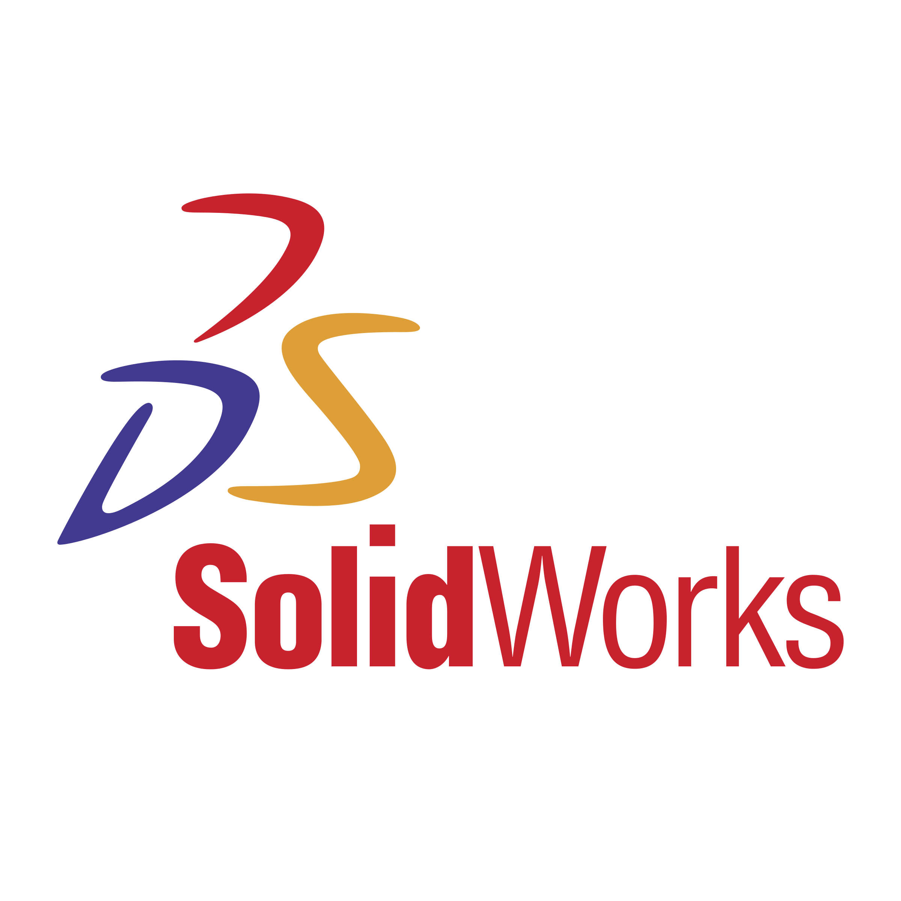
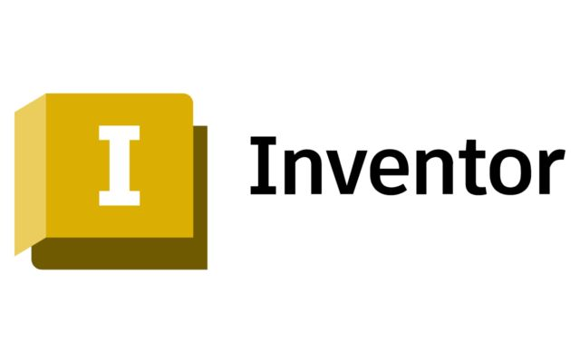
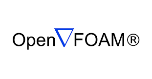

<h1 align="center">Hi 👋, I'm Anoopkrishna Krishnakumar!</h1>

<h3 align="center">Problem ➾ Brainstorm ➾ Concept Dev. ➾ Design ➾ Build ➾ Test</h3>

---
<!-- your animated GIF, floated right -->

<!-- clear the float so everything below starts underneath the GIF -->

<!-- Short bio -->

  I’m a competent Mechanical Design Engineer with a passion for turning complex
  problems into elegant solutions—specializing in CAD, FEA, and prototype development.

<blockquote>
  

    

      <strong>👩🏻‍💻 Mechanical Design Engineer.</strong>
    

    

      <strong>👩🏻‍🎓 Holds MSc. in Mechanical Engineering.</strong>
    

    

      <strong>💭 Currently building skills in programming languages 🐍.</strong>
    

    

      <strong>🥅 2026 Goals: Contribute more to Open Source projects!</strong>
    

  

</blockquote>

 
 

---

## 🛠️ Arsenal

  <!-- Design Tools (no border) -->
  

    <h4>📏📐 Design Tools</h4>
    

      <!-- your logos… -->
      
      
      
    

  

  <!-- Simulation Tools (left border) -->
  

    <h4>🔧📈 Simulation Tools</h4>
    

      <!-- your logos… -->
      
      
      
      
    

  

  <!-- Programming Languages (left border) -->
  

    <h4>💻 Programming Languages</h4>
    

      <!-- your logos… -->
      
      
      
      
    

  

---

<!-- Contact & Repos -->
<h2 align="center">📫 Reach me on</h2>

  
  

---

<h2 align="center">💻 Check Out My Repos ⬇️</h2>

---
